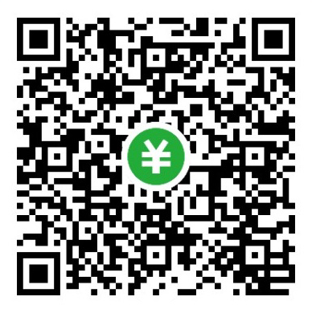

# OSC-开源咖啡

[![CC BY 4.0][cc-by-shield]][cc-by]

该项目采用 [Creative Commons Attribution 4.0 International License][cc-by] 许可证.

[![CC BY 4.0][cc-by-image]][cc-by]

## 我知道什么是咖啡，但什么是“开源咖啡”？

如果你喜欢咖啡，并且渴望挖掘一杯咖啡背后更多的信息，我们希望开源咖啡能够为你提供一个不错的选择。

## 我知道什么是开源，但什么是“开源咖啡”？

如果你懂得如何运用开放的互联网资源，同时又恰好喜欢咖啡，我们希望开源咖啡能够为你提供一个不错的选择。

## 咖啡有什么好开源的？

咖啡是多领域技术和人类感官艺术的完美融合。就像编译一套软件（执行码），制作一杯咖啡（执行码）包含多个复杂的环节，每一个环节都包含多如繁星的影响最终结果（味道）的因素或变量（源码）。虽然人体感官存在个体差异，但是想（重复）达到相同或相近的感官体验离不开科学和技术的有力支撑。对此，我们致力于做到的一点是，在我们所拥有的技术条件和认知范围内，我们会尽最大努力公开分享对最终结果可能产生影响的数据。这些数据包括但不限于：咖啡豆的烘焙曲线，烘焙环境，咖啡生豆，来源，设备器材等。这类似于（我们知道这并不完全等同于）开源一套软件的源码，使用者能够自由的使用这当中（希望是）有用的信息，为己所用--或是直接复制配方自己通过原材料一步步来制作咖啡（相当于利用源码编译软件得到执行码），或是结合自身经验和知识的积累进一步改良配方，产生更有价值的成果，这是我们更愿意看到的。当然，与其他的开源项目一样，你也可以通过各种方式回馈这个项目--[提交issue](https://www.gitee.com/os_coffee/product/issues), [Fork](#如何Fork), [提交PR](#如何提交PR), [在项目页面下方提交评论](https://gitee.com/os_coffee/product#tree_comm_title), 或是[Donate](#如何资助).

## 这里的开源信息是如何维护的?

这个项目作为“OSC开源咖啡”的入口，记录着我们定义为最终呈现给消费者的产品。同时为便于管理和维护，我们把不同的信息归类拆分成不同的子项目。

- 关于咖啡生豆的信息，我们统一放在[OSCoffee/origin](https://os_coffee.gitee.io/origin/#/).
- 关于生豆的烘焙，以及设备的信息，放在[OSCoffee/roastery](https://os_coffee.gitee.io/roastery/#/).
- [查看OSC-开源咖啡的所有项目](https://www.gitee.com/os_coffee)

如果这种信息的组织方式给您带来任何不便，我们感到非常抱歉。如果您感到不便或者有更好的建议，欢迎随时[提交issue](https://www.gitee.com/os_coffee/product/issues)或[在项目下方留下评论](https://www.gitee.com/os_coffee/product#tree_comm_title).

## 如何Fork

参考上述[开源信息的维护方式](#这里的开源信息是如何维护的), 请跳转到您所需的子项目中进行Fork操作。

## 如何提交PR

参考上述[开源信息的维护方式](#这里的开源信息是如何维护的), 请跳转到您所需的子项目中进行Fork操作创建属于个人自由修改和维护的分支。完成修改后可参考gitee的通用规则提交子项目的PR。

## 如何资助

由于目前gitee申请开通Donation的要求和限制，暂未开放gitee的donate渠道。这个开源项目是非盈利性质的，您可以通过微信支付扫描以下二维码进行资助，支持信用卡支付。微信平台会收取0.38%（平台优惠活动期间）或0.6%（正常费率）的手续费，在接收方扣取。在此非常感谢您的理解与支持！

<!--  -->

## 什么是Creative Commons许可证？

在开源社区里，Creative Commons的许可证可以说是很灵活的，它有很多个版本，而我们选择的这个 [Attribution 4.0 International License][cc-by] 则是自由度最高的版本。您可以随意参考和使用本项目中任何一种咖啡生豆的烘焙资料或者多种豆子的拼配配方，来开发属于自己的产品，不管是盈利还是非盈利的。如果我们提供以及分享的信息或数据对您的事业或商业有帮助，我们会因此感到高兴。除此之外，我们更希望看到的是，您愿意选择继续沿用这个开源协议或其他的开源协议并公开分享部分或全部有帮助的咖啡信息（虽然这个协议本身并没有强制要求你这么做），来更好的帮助其他人。

[cc-by]: https://creativecommons.org/licenses/by/4.0/deed.zh
[cc-by-image]: https://i.creativecommons.org/l/by/4.0/88x31.png
[cc-by-shield]: https://img.shields.io/badge/License-CC%20BY%204.0-lightgrey.svg
