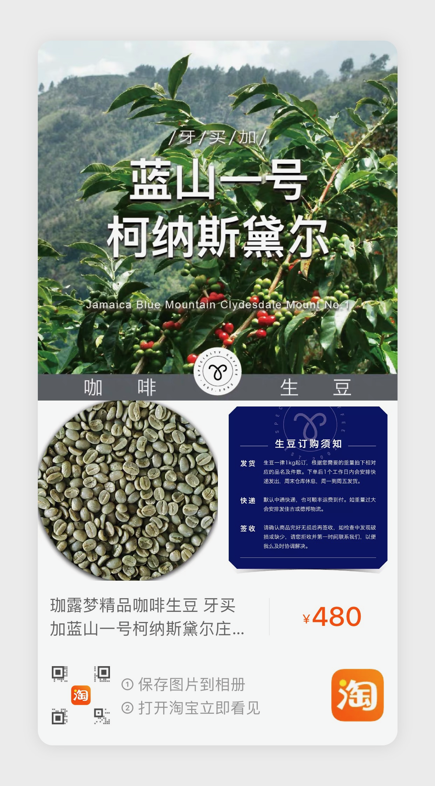

# 基本信息

|             |                  |
|-------------|------------------|
| __品名__     | 牙买加蓝山一号     |
| __品种__     | 铁皮卡            |
| __产地/产区__ | 牙买加-圣安德鲁教区 |
| __庄园__     | 柯纳斯黛尔庄园     |
| __海拔__     | 1000-1250        |
| __产季__     | 2019/2020        |
| __等级__     | N/A              |
| __含水率__    | N/A             |
| __密度__     | N/A              |
| __处理方式__  | 全水洗           |

# 采购信息

|                 |                                |
|-----------------|--------------------------------|
| __采购编号__     | PR2                            |
| __重量__        | 1 kg                            |
| __采购来源__     | [淘宝](https://www.taobao.com/) |
| __价格__        | ￥480.00                        |
| __单价(RMB/g)__ | ￥0.48                          |
| __采购日期__     | 2020-07-16                     |
| __到货日期__     | 2020-07-19                     |

# 评价

草本味，色泽一致，均匀，大小较一致

# 备注

当时采购的商品在淘宝上已下架

# 链接

[关于开源咖啡生豆仓库](https://os_coffee.gitee.io/origin)