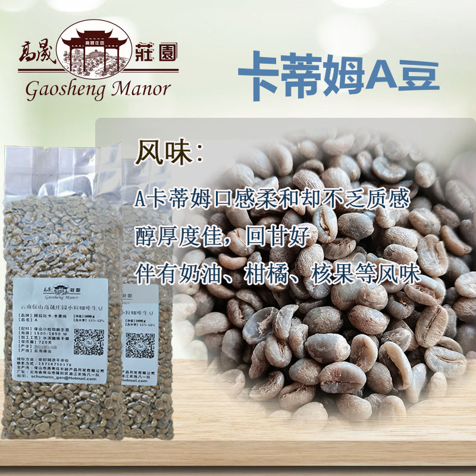
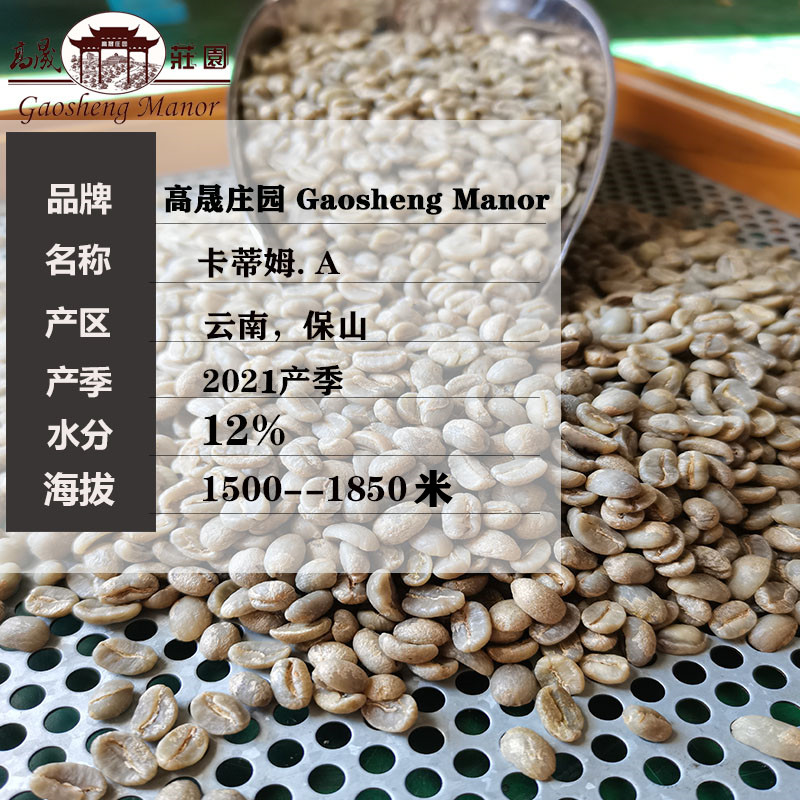

# 高晟庄园 卡蒂姆A 水洗

## 生豆信息

**供应商:** [高晟庄园](https://shop127100694.taobao.com/?spm=2013.1.1000126.3.4b27548aedY4jC)

**产地/产区:** 云南保山

**品种:** Catimor (卡蒂姆)

**处理法:** 水洗晒场干燥

**海拔:** 1500-1850m

**商品链接:** [高晟庄园 卡蒂姆A 水洗](https://item.taobao.com/item.htm?spm=a1z09.2.0.0.5bd52e8dTi51RC&id=551808487537&_u=sdd632b11)
