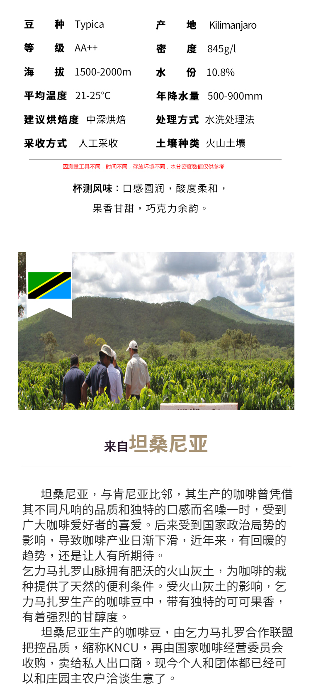

# 倩如咖啡 坦桑尼亚 乞力马扎罗 Kilimanjaro水洗 AA++

## 生豆信息

**供应商:** [倩如咖啡](https://qianrucoffee.taobao.com/?spm=2013.1.0.0.40654cd8qKKHPs)

**产地/产区:** 坦桑尼亚，乞力马扎罗

**品种:** Typica (铁皮卡)

**处理法:** 水洗

**海拔:** 1500-2000m

**商品链接:** [倩如咖啡 坦桑尼亚 乞力马扎罗 Kilimanjaro水洗 AA++](https://item.taobao.com/item.htm?spm=a1z09.2.0.0.45822e8d41lpuR&id=37512326013&_u=cdd639d38)
